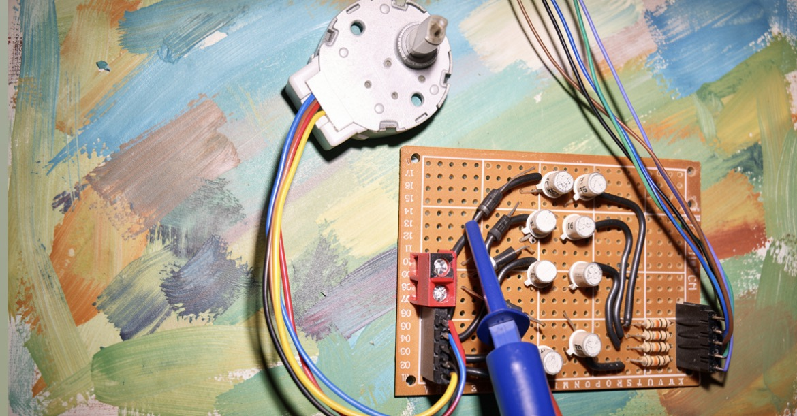
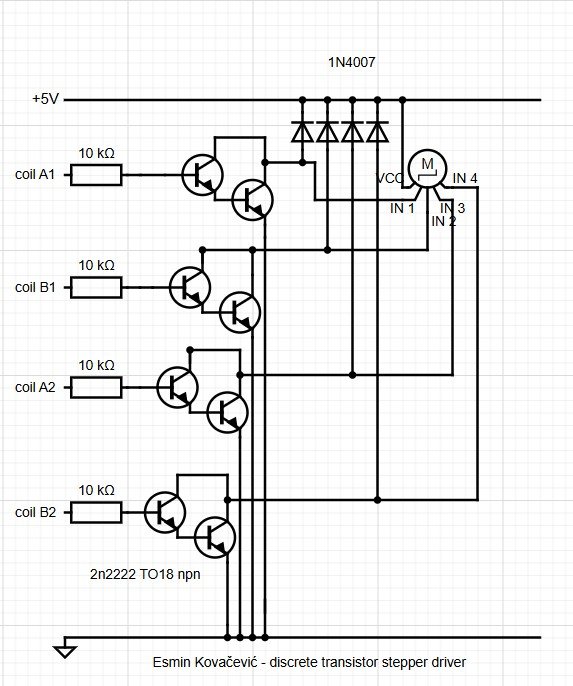

# discrete-transistor-stepper-driver

Custom Darlington pair driver board for 5-wire stepper motors.

## Features
* **Discrete Components:** Built using classic 2N2222 TO-18 metal-can NPN transistors instead of integrated ICs.
* **Darlington Pair Configuration:** Boosts input current handling for switching inductive loads.
* **Integrated Flyback Protection:** Uses 1N4007 diodes to safely clamp high-voltage inductive spikes.
* **5-Wire Compatibility:** Optimized for unipolar motors with a common VCC rail.

## Hardware Build
Here is the fully assembled driver board built on a prototyping perfboard, connected to the stepper motor:

## Schematic
The circuit layout drawn from the hardware configuration:

## How It Works
Each motor channel consists of a 10 kΩ base resistor protecting a two-stage Darlington transistor configuration. When a logic high signal (from a microcontroller) is applied to an input channel (`coil A1`, `coil B1`, etc.), the Darlington pair saturates, pulling that specific motor coil to ground and allowing current to flow from the common +5V rail.

## Software Usage (MicroPython)
The repository includes a control script (`main.py`) to cycle the stepper motor forward and backward using a MicroPython-compatible development board (such as a Raspberry Pi Pico).

### Pin Configuration
Connect the microcontroller GPIO pins to the driver inputs as follows:
* **Pin 13** -> Input A1
* **Pin 12** -> Input B1
* **Pin 11** -> Input A2
* **Pin 10** -> Input B2

The code utilizes a wave-drive step sequence matrix to pulse the coils sequentially with a 2ms delay between transitions.

## License
This project is licensed under the MIT License - see the LICENSE file for details.
